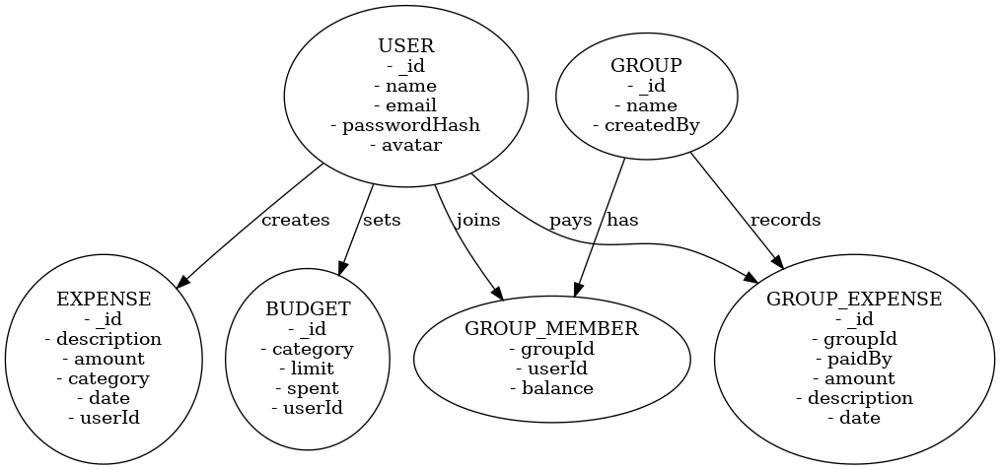
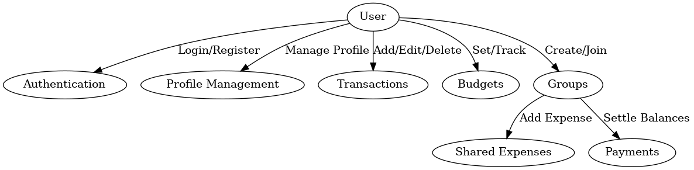

💰 Personal Budget Tracker (MERN)

A full-stack personal finance manager built with the MERN stack (MongoDB, Express, React, Node.js). It helps users track income, expenses, budgets, and groups while also supporting authentication with JWT + refresh tokens and profile settings with avatar upload.

🚀 Features

🔐 Authentication
- Secure login with JWT access + refresh tokens  
- Auto-refresh of tokens when expired  
- Logout with refresh token invalidation  

👤 Profile Management
- Update name, email, password  
- Upload & display profile avatar  

💵 Income & Expenses
- Add, edit, and delete entries  
- Categorized transactions  

📊 Budgets
- Set category-based budgets  
- Real-time progress bar tracking  
- Alerts when over budget  

👥 Groups
- Create groups & add members  
- Record shared expenses  
- Auto-calculate balances (who owes whom)  
- Settle payments between members  

🎨 UI/UX
- Responsive React frontend  
- Sidebar navigation  
- Cards, forms, and charts for easy tracking  

🛠️ Tech Stack

**Frontend**
- React (CRA / Vite)
- React Router  
- Context API / LocalStorage  
- CSS (custom + utility classes)  

**Backend**
- Node.js + Express  
- MongoDB + Mongoose  
- JWT Authentication (Access + Refresh)  
- Multer (for avatar uploads)  
- Bcrypt (for password hashing)  
- CORS & dotenv  

📂 Project Structure

personal-budget-tracker
├── backend
│   ├── Controllers
│   │   ├── authController.js
│   │   ├── userController.js
│   │   ├── budgetController.js
│   │   └── groupController.js
│   ├── Middlewares
│   │   └── Auth.js
│   ├── Models
│   │   ├── User.js
│   │   ├── Expense.js
│   │   └── Group.js
│   ├── Routes
│   │   ├── AuthRouter.js
│   │   ├── UserRouter.js
│   │   ├── BudgetRouter.js
│   │   └── GroupRouter.js
│   └── server.js
│
├── frontend
│   ├── src
│   │   ├── components
│   │   ├── pages
│   │   │   ├── Dashboard.js
│   │   │   ├── BudgetsPage.js
│   │   │   ├── GroupsPage.js
│   │   │   ├── GroupDetailsPage.js
│   │   │   ├── IncomePage.js
│   │   │   ├── ExpensesPage.js
│   │   │   └── ProfileSettings.js
│   │   ├── styles
│   │   │   ├── layout.css
│   │   │   └── forms.css
│   │   ├── utils.js (fetchWithAuth, helpers)
│   │   └── App.js
│   └── package.json
```

⚙️ Setup & Installation

1. Clone the repository
git clone https://github.com/<your-username>/personal-budget-tracker.git
cd personal-budget-tracker

2. Backend Setup
cd backend
npm install

Create a `.env` file inside backend/:  

MONGO_URI=mongodb+srv://
JWT_SECRET=yourAccessSecret
JWT_REFRESH_SECRET=yourRefreshSecret
PORT=8080

Run backend:
npm run dev   # or node server.js


3. Frontend Setup
cd frontend
npm install
npm start

🌍 Deployment

 Backend (Render/Heroku)
- Push backend to GitHub  
- Deploy on Render or Railway  
- Add environment variables in deployment dashboard  

 Frontend (Vercel/Netlify)  
- Push frontend to GitHub  
- Deploy with Vercel or Netlify  
- Update `APIUrl` in `frontend/src/utils.js` to your deployed backend URL  

🧪 API Endpoints

 Auth   
- POST `/auth/login` → Login  
- POST `/auth/refresh` → Refresh token  
- POST `/auth/logout` → Logout  

 User  
- GET `/user/profile` → Get profile  
- PUT `/user/name` → Update name  
- PUT `/user/email` → Update email  
- PUT `/user/password` → Update password  
- PUT `/user/avatar` → Upload avatar  

 Budgets  
- GET `/budgets` → Get budgets  
- PUT `/budgets` → Update budgets  

 Groups  
- GET `/groups` → List groups  
- POST `/groups` → Create group  
- POST `/groups/:id/expense` → Add expense  
- POST `/groups/:id/settle` → Settle balances  
- GET `/groups/:id/balances` → View balances  

🗂️ ER Diagram  




📄 Software Requirements Specification (SRS)
 
1. Introduction
 - **Purpose**: The Personal Budget Tracker helps users track income, expenses, budgets, and group expenses.  
 - **Scope**: Web-based MERN stack application with JWT authentication, profile management, budgeting, and group expense sharing.  
 - **Users**: Individual users, group members (friends, family, roommates).  
  
2. Overall Description
  
 System Perspective:  
 - Frontend: React (SPA)  
 - Backend: Node.js + Express + MongoDB  
 - Authentication: JWT with access + refresh tokens  

 System Functions:  
 - Authentication and profile management  
 - Add/update/delete income and expenses  
 - Set budgets and get alerts  
 - Create/join groups and track shared expenses  

3. Functional Requirements
 1. Authentication & User Management  
 2. Transactions  
 3. Budgets  
 4. Groups & Shared Expenses  

4. Non-Functional Requirements
 - Performance  
 - Scalability  
 - Security  
 - Usability  
 - Reliability  

5. Use Case Diagram  


6. Future Enhancements
 - AI-powered spending insights  
 - Multi-currency and localization support  
 - Dark mode UI  

👤 Demo Credentials

 Use these credentials after deployment for testing:  
 Email: demo@demo.com  
 Password: demo1234  

 (Or register a new account from the signup page)

 📸 Screenshots

 👉 Dashboard, Budgets, Groups, and Profile Settings with avatar upload  
 (Add your screenshots here after deployment)

 🙌 Contributing

 Pull requests are welcome! If you’d like to add features (charts, export CSV, etc.), feel free to fork the repo and contribute.

 📜 License

 This project is licensed under the MIT License.
